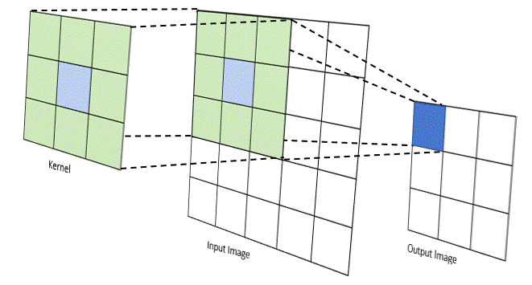
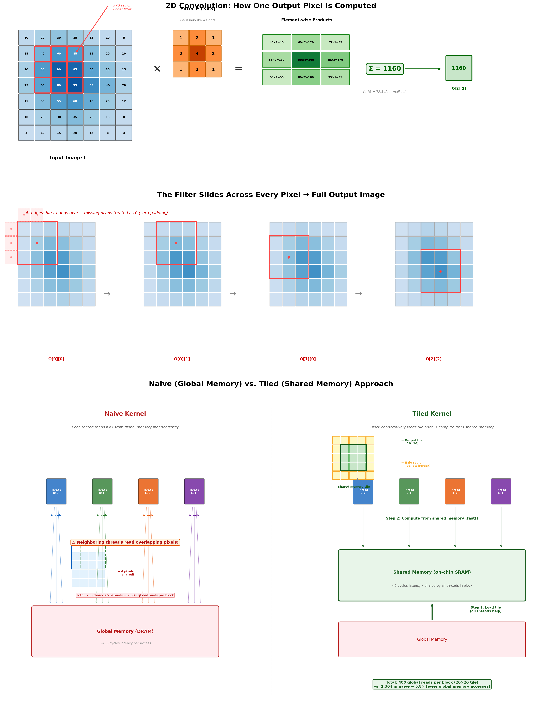

# GPU Programming Project: 2D Image Convolution

**Individual Assignment — Modules 4, 5, 6**

## 1. Overview

In this project, you will implement a 2D image convolution kernel in CUDA through three progressively optimized versions. Convolution is a core operation in image processing and deep learning, where a small filter (kernel mask) slides across every pixel of an input image, computing a weighted sum of neighboring pixels at each position. This is computationally intensive and maps naturally to GPU parallelism.

By building three versions of the same algorithm, you will directly experience how shared memory tiling, control divergence handling, and memory coalescing transform a slow naive implementation into a high-performance GPU kernel.

## 2. Background: 2D Convolution

Given an input image **I** of size H×W and a convolution filter **F** of size K×K (where K is odd), the output pixel at position (row, col) is computed as:

```
O[row][col] = ΣΣ F[ky][kx] × I[row - K/2 + ky][col - K/2 + kx]
```

where `ky` and `kx` iterate from 0 to K-1.

Pixels outside the image boundary are treated as zero (zero-padding). The filter F is small (typically 3×3, 5×5, or 7×7), read-only, and accessed by every thread, making it a prime candidate for constant memory.

### How Convolution Works

The animation below shows the filter sliding across the input image, computing one output pixel at each position:



The diagram below breaks down the full process — how a single output pixel is computed from element-wise products, how the filter slides to produce the full output, and why the tiled shared memory approach dramatically reduces global memory accesses compared to the naive approach:



## 3. Project Structure (3 Parts)

### Part 1: Naive Global Memory Kernel (25 points)

Implement a straightforward convolution kernel where each thread computes one output pixel by reading directly from global memory. No shared memory, no optimization.

**File:** `convolution_naive.cu`

**What to implement:** Complete the `convNaiveKernel` function.

Each thread maps to one output pixel using its 2D block/thread index. It loops over the K×K filter, reads the corresponding input pixel from global memory, multiplies by the filter weight, and accumulates the result. Out-of-bound input coordinates produce a zero contribution (zero-padding).

**Module concepts tested:**

- Basic CUDA kernel design with 2D thread indexing
- Boundary condition checking (Module 5: control divergence awareness)
- Understanding that every thread independently reads from global memory with no data reuse

### Part 2: Tiled Shared Memory Kernel (40 points)

Implement a tiled convolution kernel that uses shared memory to reduce redundant global memory accesses. This is the core optimization.

**File:** `convolution_tiled.cu`

**What to implement:** Complete the `convTiledKernel` function.

The key insight is that neighboring output pixels share many of the same input pixels. In the naive version, these overlapping pixels are loaded from global memory repeatedly. In the tiled version, a thread block cooperatively loads a tile of input data (including a halo region of K/2 pixels around the edges) into shared memory, calls `__syncthreads()`, then each thread computes its output pixel from the fast shared memory instead of slow global memory.

**Design details:**

- Define `TILE_SIZE` as the number of output pixels per block dimension (e.g., 16)
- The shared memory tile must be `(TILE_SIZE + K - 1) × (TILE_SIZE + K - 1)` to include the halo
- Each thread may need to load more than one element into shared memory (since the shared tile is larger than the thread block)
- Handle boundary conditions: threads loading halo pixels that fall outside the image must write `0.0` to shared memory
- Call `__syncthreads()` after the cooperative load, before computing the output

**Module concepts tested:**

- Shared memory and data locality (Module 4: tiling strategy, halo cells)
- Tile boundary conditions (Module 4: Lecture 4-5)
- Control divergence from boundary checks (Module 5: analyze which warps diverge)
- `__syncthreads()` for correctness (Module 4: barrier synchronization)

### Part 3: Performance Analysis and Optimization (35 points)

Benchmark both kernels, analyze the performance difference, and write a structured analysis report.

**File:** `benchmark.cu` (provided — just run it)

**Deliverable:** Written report (1–3 pages) addressing all items below.

#### 3a. Benchmarking (10 points)

Run the provided benchmark program with the following configurations and record execution times:

| Image Size | Filter Size | Configuration Purpose |
|---|---|---|
| 512 × 512 | 3 × 3 | Small image, small filter (baseline) |
| 512 × 512 | 7 × 7 | Small image, large filter (more data reuse) |
| 2048 × 2048 | 3 × 3 | Large image, small filter |
| 2048 × 2048 | 7 × 7 | Large image, large filter (worst-case global memory) |
| 4096 × 4096 | 5 × 5 | Very large image (tests bandwidth saturation) |
| 1000 × 1000 | 5 × 5 | Non-power-of-2 (tests boundary handling) |

PGM test images for each configuration are provided in the `images/` directory. The benchmark program loads them automatically. If the images are missing, run:

```bash
python3 generate_sample.py --benchmark
```

#### 3b. Memory Coalescing Analysis (10 points)

Analyze the memory access patterns of both kernels. In your report, address:

1. In the naive kernel, is the access to the input image coalesced? Show the index expression and explain which part varies with `threadIdx.x`.
2. In the tiled kernel, is the cooperative load from global memory into shared memory coalesced? Explain why or why not by examining the index calculation.
3. Once data is in shared memory, does the access pattern during convolution computation matter for performance? Why or why not? (Hint: think about DRAM bursts vs. on-chip SRAM.)
4. For the 1000×1000 image case: how many DRAM burst sections are wasted by the naive kernel per warp compared to the tiled kernel?

#### 3c. Control Divergence Analysis (10 points)

Analyze warp divergence for the 1000×1000 image with a 5×5 filter and 16×16 thread blocks:

1. How many thread blocks are launched? How many warps total?
2. Which warps experience control divergence from the boundary condition check in the naive kernel? Estimate the percentage of divergent warp-phases. (Apply the same analysis method used for Type 1/Type 2 blocks in Lecture 5-2.)
3. In the tiled kernel, where does control divergence occur: during the cooperative loading phase, during the computation phase, or both? Explain which warps are affected in each phase.
4. Does the tiled kernel have more or fewer total divergent warp-phases than the naive kernel? Why?

#### 3d. Speedup Discussion (5 points)

Based on your benchmark results and analysis:

1. What speedup does the tiled kernel achieve over the naive kernel for each test case?
2. Does the speedup increase with larger filter sizes? Explain why in terms of data reuse ratio.
3. If you were to further optimize the kernel, what would you try next and which module concept would it leverage? (e.g., using constant memory for the filter, adjusting tile sizes for occupancy, loop unrolling)

## 4. Provided Files

| File | Description |
|---|---|
| `convolution_naive.cu` | Part 1 skeleton — implement `convNaiveKernel()` |
| `convolution_tiled.cu` | Part 2 skeleton — implement `convTiledKernel()` |
| `benchmark.cu` | Part 3 benchmarking harness (run as-is) |
| `demo.cu` | Visual demo — apply filters to real images |
| `common.h` | Shared utilities, PGM image I/O, verification, timing macros |
| `generate_sample.py` | Generates test images (PGM format) for benchmark and demo |
| `images/` | Pre-generated PGM test images for all benchmark configurations |
| `Makefile` | Build targets for all parts |

## 5. Building and Running

### Prerequisites

- NVIDIA CUDA Toolkit (nvcc compiler)
- Python 3 (for generating test images)
- An NVIDIA GPU with compute capability ≥ 6.0

### Build Commands

```bash
# Build and run each part
make naive          # Builds and runs Part 1 with verification
make tiled          # Builds and runs Part 2 with verification
make benchmark      # Generates test images, builds, and runs Part 3 benchmarks
make demo           # Runs all 5 filters on a sample image (visual output)
make all            # Builds everything

# Test with specific sizes
make test-small     # 256×256 with 3×3 filter
make test-boundary  # 1000×1000 with 5×5 filter

# Utilities
make sample         # Generate sample_input.pgm only
make clean          # Remove binaries and generated images
```

Each target compiles the corresponding `.cu` file, runs it with a test image, and verifies correctness against a CPU reference implementation. **You must pass verification before your performance numbers are meaningful.**

### Visual Demo (Optional but Recommended)

After completing Part 2, try applying different filters to a real image:

```bash
make demo                              # Apply all 5 filters to sample image
./conv_demo sample_input.pgm blur      # Apply only box blur
./conv_demo sample_input.pgm edge      # Apply only edge detection
./conv_demo myimage.pgm all            # Use your own PGM image
```

Output files (`output_blur.pgm`, `output_sharpen.pgm`, `output_edge.pgm`, etc.) can be viewed in GIMP, Photoshop, IrfanView, or on Linux with `display output_blur.pgm` (ImageMagick).

Available filters: `blur`, `gaussian`, `sharpen`, `edge`, `emboss`, `all`

## 6. Grading Rubric

**Total: 100 points**

| Criterion | Points | Key Requirements |
|---|---|---|
| Part 1: Naive kernel correctness | 15 | Passes verification |
| Part 1: Boundary handling | 10 | Correct zero-padding |
| Part 2: Tiled kernel correctness | 20 | Passes verification |
| Part 2: Shared memory usage | 10 | Proper halo loading |
| Part 2: Synchronization | 10 | Correct `__syncthreads()` |
| Part 3a: Benchmark results | 10 | All 6 configurations |
| Part 3b: Coalescing analysis | 10 | Index-level reasoning |
| Part 3c: Divergence analysis | 10 | Warp-phase counting |
| Part 3d: Speedup discussion | 5 | Insightful explanation |

## 7. Submission Requirements

Submit the following files as a single `.zip` archive to the course platform:

1. `convolution_naive.cu` — completed Part 1
2. `convolution_tiled.cu` — completed Part 2
3. `report.pdf` — performance analysis report (Parts 3a–3d), 1–3 pages
4. Screenshot of successful verification output for both kernels

## 8. Hints and Tips

1. **Start with Part 1.** Get it passing verification before moving to Part 2. The tiled kernel is harder to debug if your basic logic is wrong.

2. **For Part 2, draw the shared memory tile on paper first.** Mark the output region (`TILE_SIZE × TILE_SIZE`) and the halo region (K/2 pixels on each side). Understand which threads load which elements.

3. **A common bug in Part 2:** forgetting that the shared memory tile is larger than the thread block. You may need each thread to load multiple elements. Use a strided loop pattern.

4. **For the analysis,** review Lecture 5-2 slides on Type 1/Type 2 blocks and how to count divergent warp-phases. The same methodology applies to convolution boundary checks.

5. **The filter is read-only and small.** Consider whether placing it in constant memory (using `__constant__`) would improve performance — this makes a great discussion point for Part 3d.

6. **Use CUDA error checking** after every kernel launch and memory operation. The `CHECK_CUDA` macro in `common.h` does this for you.

7. **Use the visual demo** to build intuition. Seeing what blur, sharpen, and edge detection actually do to an image helps you understand why the convolution loop is structured the way it is.

## 9. Academic Integrity

This is an individual assignment. You may discuss high-level approaches with classmates, but all code and analysis must be your own. The analysis report must reflect your own understanding — generic or copied explanations will receive zero credit for the corresponding section.
